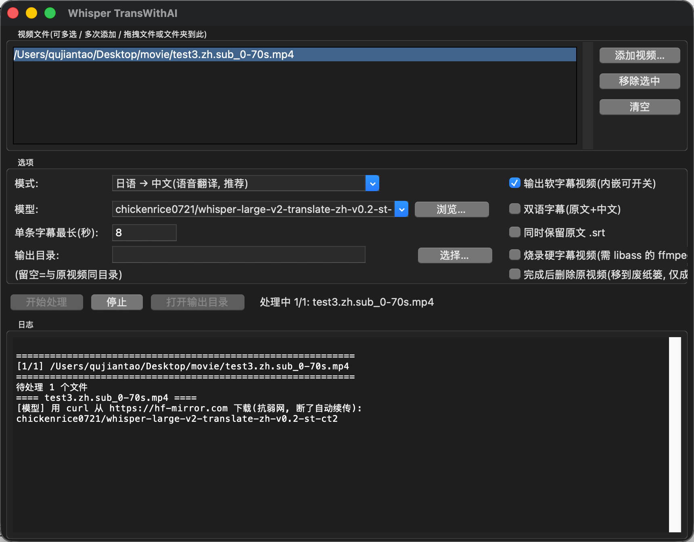
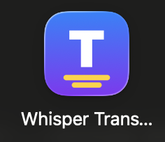
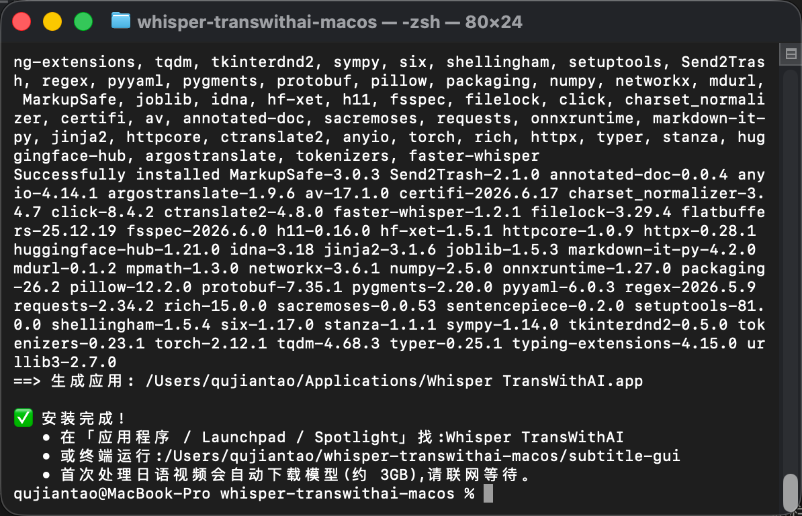

# Whisper TransWithAI — 视频自动加中文字幕(macOS)

把视频自动转写并翻译成中文字幕,带图形界面、批量处理,可同时输出 `.srt` 和内嵌软字幕的视频。

管线:`视频 → faster-whisper 识别(带时间轴, VAD 抗幻觉)→ 翻译/语音翻译 → 中文 .srt (+ 软字幕视频)`

## 预览

<p align="center">
  <br>
  <em>图形界面 · 拖入视频 → 选模式 → 开始处理</em>
</p>

<table>
<tr>
<td align="center"><br><sub>应用图标</sub></td>
<td align="center"><br><sub>一键安装(<code>./install.sh</code> 跑完即生成 App)</sub></td>
</tr>
</table>

## 安装

**前置**:macOS + [Homebrew](https://brew.sh)(没有的话装一下)。

```bash
git clone https://github.com/alanqjt/whisper-transwithai-macos.git
cd whisper-transwithai-macos
./install.sh
```

> 国内若 HTTPS clone 超时,改用 **SSH**(需已在 GitHub 配好 SSH key):
> ```bash
> git clone git@github.com:alanqjt/whisper-transwithai-macos.git
> ```

`install.sh` 会自动:装 `ffmpeg` 和 `python-tk@3.13` → 建虚拟环境装依赖 → 生成命令行工具和 **Whisper TransWithAI.app**(放进 `~/Applications`)。

装完在 **Launchpad / Spotlight / 应用程序** 里就能找到 **Whisper TransWithAI**。

> 首次处理日语视频会自动下载语音翻译模型(约 3GB),之后缓存复用。
> 默认走国内镜像 `hf-mirror.com`(并关闭 xet,否则镜像下载会失败)。想用官方源:运行前 `export HF_ENDPOINT=https://huggingface.co`。

## 图形界面用法

打开 **Whisper TransWithAI**:
1. 把视频(或文件夹)**拖进**列表,或点「添加视频…」(可多选)
2. 选**模式**:日→中(语音翻译)/ 中文视频 / 英→中 / 其他外语自动检测
3. (可选)改**模型**、勾「输出软字幕视频」「完成后删原视频」等
4. 点「**开始处理**」,日志区看进度

每个视频输出在其所在目录:**原视频 + `<名>.zh.srt` + `<名>.zh.sub.mp4`(内嵌软字幕)**。

## 命令行用法

```bash
./subtitle-gui                                   # 打开界面
./sub 视频.mp4                                    # 处理单个(默认 faster 引擎)
./sub ~/Movies --softsub                          # 批量目录, 并输出软字幕视频
# 日语 → 中文(语音翻译模型, 直接出中文):
./sub jp.mp4 --engine faster --language 日语 --task translate \
  --model chickenrice0721/whisper-large-v2-translate-zh-v0.2-st-ct2 --softsub
```

常用选项:`--language`(日语/中文/英语/auto…)`--model` `--translator argos|claude|none`
`--bilingual` `--keep-src` `--softsub` `--burn` `--max-dur 8` `--delete-source`。完整见 `./sub --help`。

## 说明 & 已知点

- **默认 faster 引擎**自带 VAD,纯音乐/无对白的视频会正确输出空字幕(避免幻觉)。
- **翻译**:`argos` 离线免费(默认);`claude` 质量更好(设 `ANTHROPIC_API_KEY`);日→中推荐用上面的**语音翻译模型**,质量最佳。
- **自定义模型**:界面「模型」框可下拉、可「浏览…」选本地 CTranslate2 模型文件夹、可粘贴任意 HuggingFace 仓库名。
- **可选引擎**:`--engine whisper`(需 `pip install openai-whisper`,拉 torch)、`--engine mlx`(Apple Silicon,`pip install mlx-whisper`)。
- **硬字幕** `--burn` 需要带 libass 编译的 ffmpeg;默认 Homebrew ffmpeg 可能不含,软字幕不受影响。

## 文件
`subtitle.py` 主逻辑 · `subtitle_gui.py` 界面 · `make_icon.py` 生成图标 · `install.sh` 安装器 · `requirements.txt` 依赖。

## 许可与致谢

本项目代码以 **MIT** 许可证开源(见 [LICENSE](LICENSE))。

本工具的日→中能力基于 **[TransWithAI](https://github.com/TransWithAI/Faster-Whisper-TransWithAI-ChickenRice)** 提供的模型,特此致谢:
- 语音翻译模型 [`chickenrice0721/whisper-large-v2-translate-zh-v0.2-st-ct2`](https://huggingface.co/chickenrice0721/whisper-large-v2-translate-zh-v0.2-st-ct2)(Apache-2.0)
- 上游项目 Faster-Whisper-TransWithAI-ChickenRice(MIT)

同时基于 [faster-whisper](https://github.com/SYSTRAN/faster-whisper)、[OpenAI Whisper](https://github.com/openai/whisper)、[Argos Translate](https://github.com/argosopentech/argos-translate) 等开源项目。
